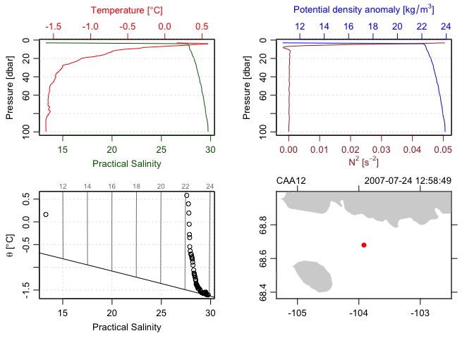

<!-- README.md is generated from README.Rmd. Please edit that file -->

# dfo

<!-- badges: start -->

[](https://github.com/dankelley/dfo/actions)
[](https://codecov.io/gh/dankelley/dfo)
<!-- badges: end -->

The goal of dfo is to facilitate the reading of several file formats
used by the Department of Fisheries and Oceans (DFO), Canada.

## Installation

<!--
You can install the released version of dfo from [CRAN](https://CRAN.R-project.org) with:

``` r
install.packages("dfo")
```
-->

You can install the development version from
[GitHub](https://github.com/) with:

``` r
# install.packages("devtools")
devtools::install_github("dankelley/dfo")
```

## Example

The following reads, summarizes, and plots an IOS-formatted CTD file
that is provided with the package. (Type `?read.ctd.ios` in an R console
for more details.)

``` r
library(dfo)
#> Loading required package: oce
#> Loading required package: gsw
#> Loading required package: testthat
#> Loading required package: sf
#> Linking to GEOS 3.8.1, GDAL 3.1.4, PROJ 6.3.1
#> Loading required package: ncdf4
file <- system.file("extdata", "2007-019-055.ctd", package="dfo")
ctd <- read.ctd.ios(file)
summary(ctd)
#> CTD Summary
#> -----------
#> 
#> * Chief scientist:     Zimmermann S.
#> * Start time:          2007-07-24 12:58:49
#> * Station:             CAA12
#> * Location:            68.679N 103.92W
#> * Data Overview
#> 
#>                                 Min.    Mean   Max. Dim. NAs              OriginalName
#>     pressure [dbar]                3  51.497   99.9   98   0                  Pressure
#>     depth [m]                    2.9  51.237   99.4   98   0                     Depth
#>     temperature [°C, ITS-90] -1.6028 -1.3202 0.5814   98   0       Temperature:Primary
#>     transmissivity ["%"/m]       0.8  61.467   68.2   98   0            Transmissivity
#>     fluorescence [mg/m³]       0.094 0.61771  4.557   98   1 Fluorescence:URU:Seapoint
#>     par [μE/m²/s]                  0  13.885  129.9   98   0                       PAR
#>     parReference [μE/m²/s]     665.3  670.77  682.6   98   0             PAR:Reference
#>     salinity [PSS-78]         13.283  28.802 29.736   98   0            Salinity:T0:C0
#>     oxygen [ml/l]               8.05  8.7396   9.56   98   0      Oxygen:Dissolved:SBE
#>     oxygen2 [μmol/kg]          351.1  381.35  417.5   98   0      Oxygen:Dissolved:SBE
#>     nitrate_plus_nitrite [V]   0.662 0.77972   1.74   98   0 Nitrate_plus_nitrite:ISUS
#>     ndata                          4  24.663     51   98   0     Number_of_bin_records
#> 
#> * Processing Log
#> 
#>     - 2021-02-09 12:11:32 UTC: `create 'ctd' object`
#>     - 2021-02-09 12:11:32 UTC: `read.ctd.ios.text("/private/var/folders/8b/l4h64m1j22v5pb7vj049ff140000gn/T/Rtmp3dFc8i/temp_libpath82a11df38d28/dfo/extdata/2007-019-055.ctd", missingValue=-99, debug=0)
#> `
plot(ctd)
```


